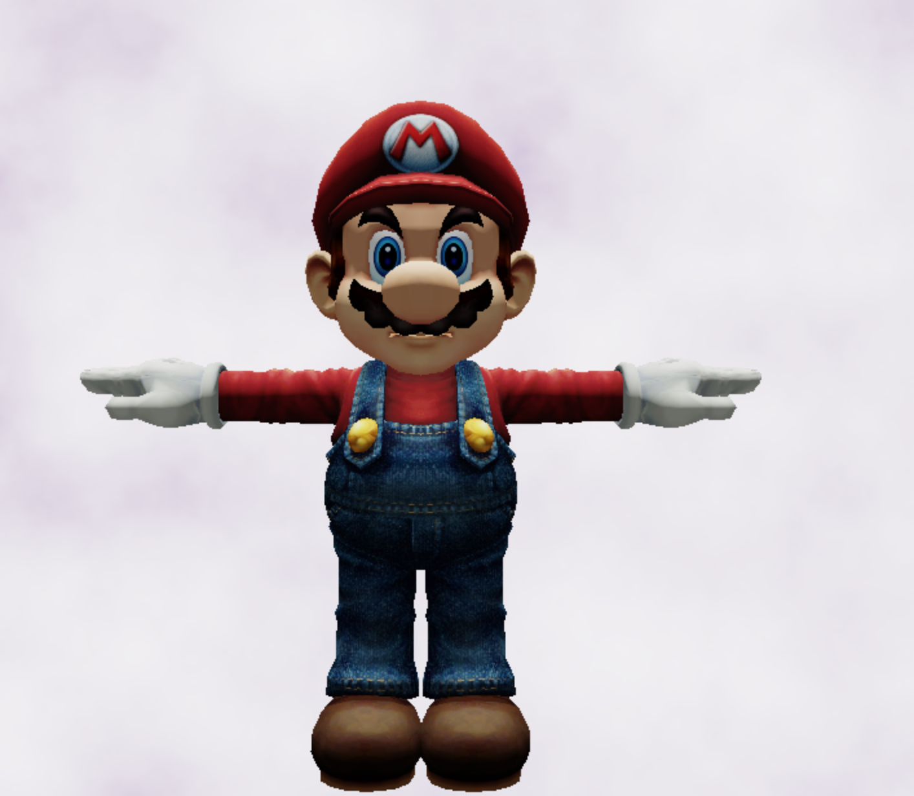
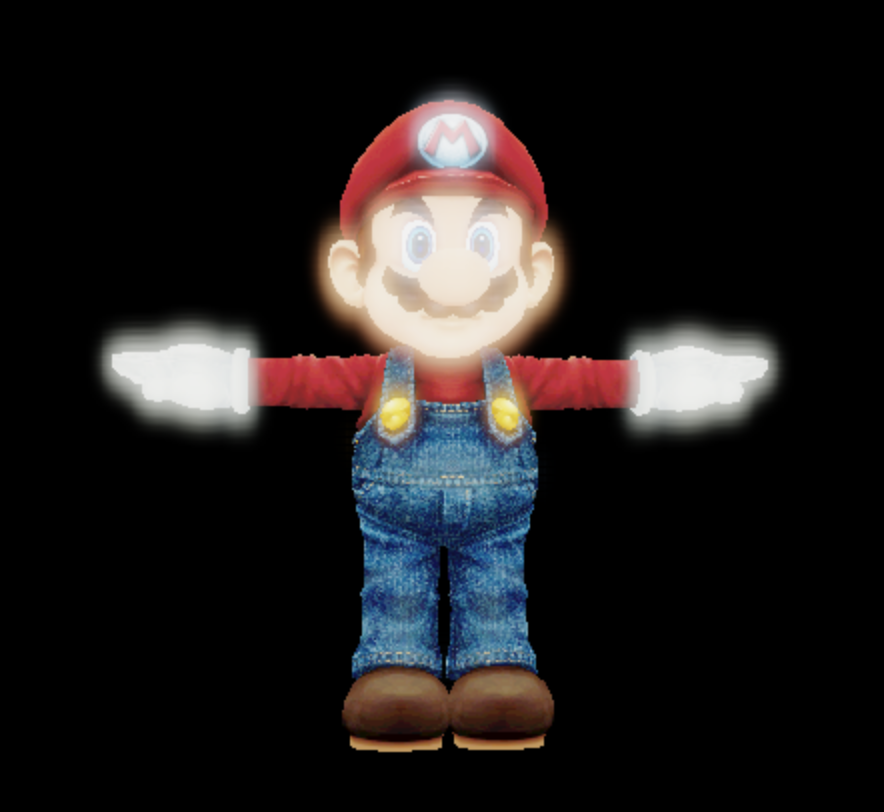
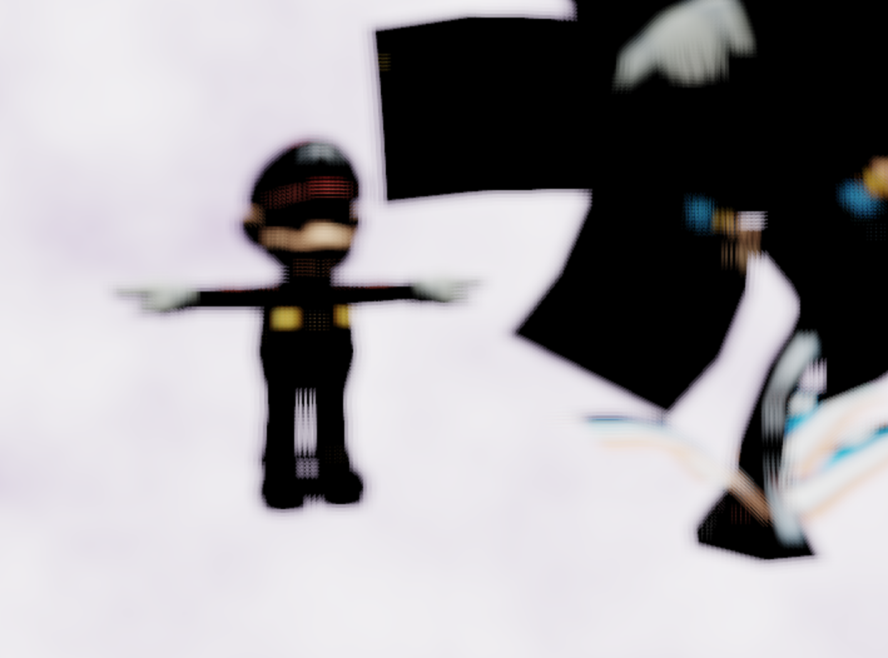
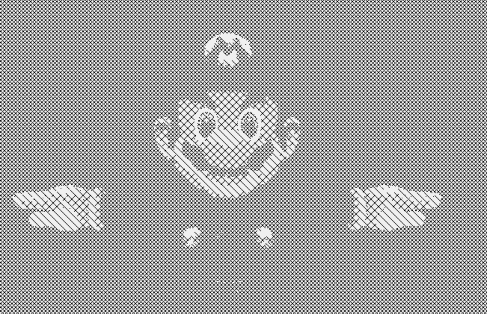
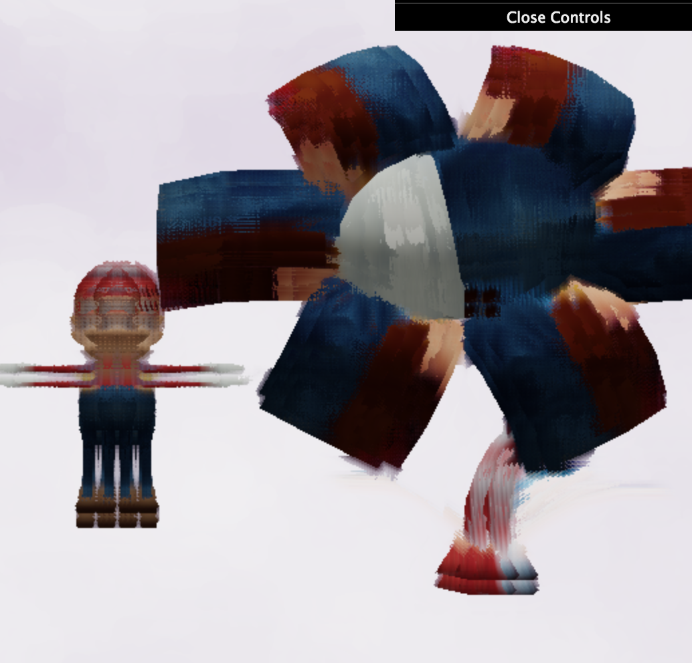

demo: https://sangeun44.github.io/homework-7-deferred-renderer-Sangeun44/

## Passing data to G-Buffers (10 points)
From `standard-frag.glsl`:
* Camera-space depth of the fragment
* World-space surface normal of the fragment
* Albedo (base color) of the fragment.

## Basic scene shading (10 points)
In `deferred-render.glsl`,
* Lambertian surface reflection 
* Ambient lighting, so areas that would be very dark are slightly lit.
* Directional or point light illumination by at least one light source.
* a time-offset noise-based image. 
* Used fbm for noise

## HDR Tone Mapping (5 points)
In `tonemap-frag.glsl`, implemented reinhard from [Filmic Worlds blog](http://filmicworlds.com/blog/filmic-tonemapping-operators/).

## Post-process effects (75 points)
three of the effects listed below to receive full credit for this assignment. 

* __Bloom:__ 

* __Approximated depth of field:__ 

* __Artistic effect:__ 

Crosshatching = http://learningwebgl.com/blog/?p=2858

   * Pencil sketch overlay shading
   * Oil painting, as seen in [The Witcher 3]

## Extra credit (30 points max)
* Use Dat.GUI to make some element(s) of your post-processes interactive, even something as simple as being able to activate and deactivate a process. (5 - 15 points)
* Implement an additional feature from the set listed above (15 points)
* [FXAA](http://developer.download.nvidia.com/assets/gamedev/files/sdk/11/FXAA_WhitePaper.pdf) (7 points)
* Shadow mapping (25 points)
* Custom 3D scene with new OBJs and textures (5 - 10 points)
* Screen-space ambient occlusion (30 points)
